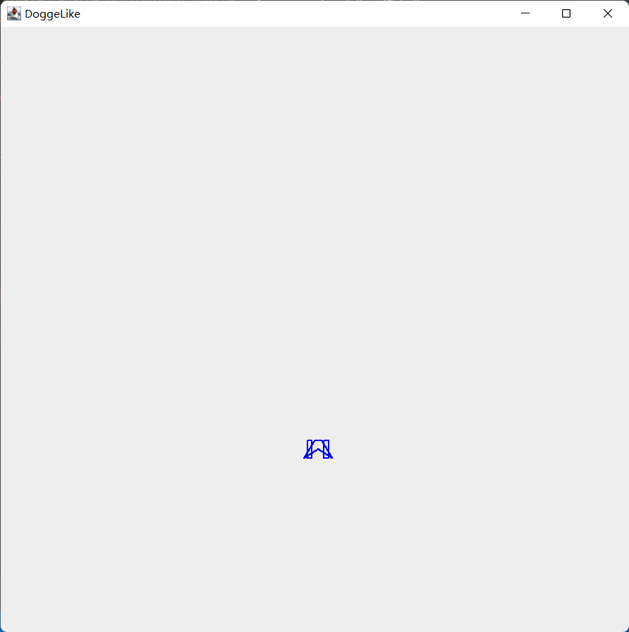

# 在背景中建立玩家对象

***********************

<br>

在这里使用的是JFrame类，为我们的程序建立一个背景框架，并在其上显示我们想要的类容。

<br>

## 原理介绍

*****************************

JFrame在整个程序中的作用相当于绘画板，其只是作为一个轻量级容器，如果不在这个容器中添加“画纸”，
那么他将无法显示类容。这个“画纸”就是我们的JPane类，我们只需要在这个类上作画，然后添加到JFrame上即可：


<br>

### 创建背景框架
*********************

创建背景框架还是比较容易的：

```java
public class background {

    private Rectangle box = new Rectangle();
    private int size_x1 = 1;
    private int size_x2 = 1;
    private int size_y1 = 900;
    private int size_y2 = 1600;

    private void scenario(){
        //JFrame创建的是框架
        JFrame scence = new JFrame("DoggeLike");
        //得到窗口容器
        Container conn = scence.getContentPane();
        //创建标签，设置初始内容
        JLabel l1 = new JLabel("DoggeLike");

        box.x = size_x1;
        box.y = size_x2;
        box.width = size_y1;
        box.height = size_y2;

        //设置窗口属性、位置、大小
        scence.setBounds(box);

        //设置窗口可见
        scence.setVisible(true);
        //设置关闭方式
        scence.setDefaultCloseOperation(WindowConstants.DISPOSE_ON_CLOSE);
    }

    //构造函数(有传递参数时)
    public background(Rectangle box){
        this.box = box;
        this.scenario();
    }

    //构造函数(无传递参数时)
    public background(){
        this.scenario();
    }
}
```

```xml
* 这个类可以通过传入rectangle对象指定其大小，或者以默认大小建立
* 这个JFrame建立的对象的一大特点是可以动态改变窗口大小，每次改变都会重新绘制一遍
```

<br>

### 绘制飞船

*****************

飞船的绘制只需要按照给定的函数进行绘制就可以了，绘制各种图形的方法都由一个叫做 *Graphics2D* 的类提供。
在定义图形绘制之前，需要重载 *JPane*  中的 __paint(Graphics g)__  方法。这个方法会在创建这个飞船实例的时候自动被调用。
因此我们只需要在这个方法中定义图形就可以了。

```java
public class ship extends JPanel {
    //各个关键点
    private static double[] O_poi = null;
    private double[] A_poi = {-4,14.0};
    private double[] M_poi = {-6,10};
    private double[] N_poi = {-6,-10.0};
    private double[] D_poi = {-4,-12};
    private double[] E_poi = {-8,-12};
    private double[] F_poi = {-8,-12};
    private double[] B_poi = {-7,12};
    private double[] C_poi = {-7,-4};

    static double[] AL_poi = {-3,14};
    static double[] AR_poi= {-3,14};

    static double[] ML_poi= {-6,10} ;
    static double[] MR_poi= {-6,10} ;

    static double[] NL_poi= {-6,-10} ;
    static double[] NR_poi = {-6,-10};

    static double[] DL_poi = {-4,-12};
    static double[] DR_poi = {-4,-12};

    static double[] FL_poi = {-8,-12};
    static double[] FR_poi = {-8,-12};

    static double[] EL_poi = {-8,-12};
    static double[] ER_poi = {-8,-12};

    static double[] BL_poi = {-7,12};
    static double[] BR_poi = {-7,12};

    static double[] CL_poi = {-7,-4};
    static double[] CR_poi = {-7,-4};

    //构造飞船关键点
    public ship(double[] o_poi){
        O_poi = o_poi;
        double[] kAL_poi = {O_poi[0] + A_poi[0], O_poi[1] + A_poi[1]};
        double[] kAR_poi = {O_poi[0] - A_poi[0], O_poi[1] + A_poi[1]};
        AL_poi = kAL_poi;
        AR_poi = kAR_poi;

        double[] kML_poi = {O_poi[0] + M_poi[0], O_poi[1] + M_poi[1]};
        double[] kMR_poi = {O_poi[0] - M_poi[0], O_poi[1] + M_poi[1]};
        ML_poi = kML_poi;
        MR_poi = kMR_poi;

        double[] kNL_poi = {O_poi[0] + N_poi[0], O_poi[1] + N_poi[1]};
        double[] kNR_poi = {O_poi[0] - N_poi[0], O_poi[1] + N_poi[1]};
        NL_poi = kNL_poi;
        NR_poi = kNR_poi;

        double[] kDL_poi = {O_poi[0] + D_poi[0], O_poi[1] + D_poi[1]};
        double[] kDR_poi = {O_poi[0] - D_poi[0], O_poi[1] + D_poi[1]};
        DL_poi = kDL_poi;
        DR_poi = kDR_poi;

        double[] kFL_poi = {O_poi[0] + F_poi[0], O_poi[1] + F_poi[1]};
        double[] kFR_poi = {O_poi[0] - F_poi[0], O_poi[1] + F_poi[1]};
        FL_poi = kFL_poi;
        FR_poi = kFR_poi;

        double[] kEL_poi = {O_poi[0] + E_poi[0], O_poi[1] + E_poi[1]};
        double[] kER_poi = {O_poi[0] - E_poi[0], O_poi[1] + E_poi[1]};
        EL_poi = kEL_poi;
        ER_poi = kER_poi;

        double[] kBL_poi = {O_poi[0] + B_poi[0], O_poi[1] + B_poi[1]};
        double[] kBR_poi = {O_poi[0] - B_poi[0], O_poi[1] + B_poi[1]};
        BL_poi = kBL_poi;
        BR_poi = kBR_poi;

        double[] kCL_poi = {O_poi[0] + C_poi[0], O_poi[1] + C_poi[1]};
        double[] kCR_poi = {O_poi[0] - C_poi[0], O_poi[1] + C_poi[1]};
        CL_poi = kCL_poi;
        CR_poi = kCR_poi;
    }
    
        //绘制飞船    
        public void paint (Graphics g){
            //由于父类中的paint中没有定义图形，调用此方法是为了清空画板；
            super.paint(g);

            //此类为Graphics类的继承，其中拥有更多的绘画方式
            Graphics2D gd = (Graphics2D) g;
            //绘制图形
            gd.setColor(Color.blue);
            //轮廓笔刷
            BasicStroke edge = new BasicStroke(2, BasicStroke.CAP_ROUND, BasicStroke.JOIN_ROUND);
            gd.setStroke(edge);

            gd.drawRect((int) this.ML_poi[0], (int) this.ML_poi[1], 12, 20);

            gd.drawLine((int) this.ML_poi[0], (int) this.ML_poi[1], (int) this.AL_poi[0], (int) this.AL_poi[1]);
            gd.drawLine((int) this.AL_poi[0], (int) this.AL_poi[1], (int) this.AR_poi[0], (int) this.AR_poi[1]);
            gd.drawLine((int) this.AR_poi[0], (int) this.AR_poi[1], (int) this.MR_poi[0], (int) this.MR_poi[1]);
            gd.drawLine((int) this.NL_poi[0], (int) this.NL_poi[1], (int) this.DL_poi[0], (int) this.DL_poi[1]);
            gd.drawLine((int) this.DL_poi[0], (int) this.DL_poi[1], (int) this.EL_poi[0], (int) this.EL_poi[1]);
            gd.drawLine((int) this.EL_poi[0], (int) this.EL_poi[1], (int) this.FL_poi[0], (int) this.FL_poi[1]);
            gd.drawLine((int) this.NR_poi[0], (int) this.NR_poi[1], (int) this.DR_poi[0], (int) this.DR_poi[1]);
            gd.drawLine((int) this.DR_poi[0], (int) this.DR_poi[1], (int) this.ER_poi[0], (int) this.ER_poi[1]);
            gd.drawLine((int) this.ER_poi[0], (int) this.ER_poi[1], (int) this.FR_poi[0], (int) this.FR_poi[1]);

            //浮筒笔刷
            BasicStroke busor = new BasicStroke(10, BasicStroke.CAP_ROUND, BasicStroke.JOIN_ROUND);
            gd.drawLine((int) this.BL_poi[0], (int) this.BL_poi[1], (int) this.CL_poi[0], (int) this.CL_poi[1]);
            gd.drawLine((int) this.BR_poi[0], (int) this.BR_poi[1], (int)this.CR_poi[0], (int) this.CR_poi[1]);

            System.out.println(this.M_poi[0]);
            System.out.println(M_poi[0]);
        }
        

}
```

经过反复修改，得到效果：

