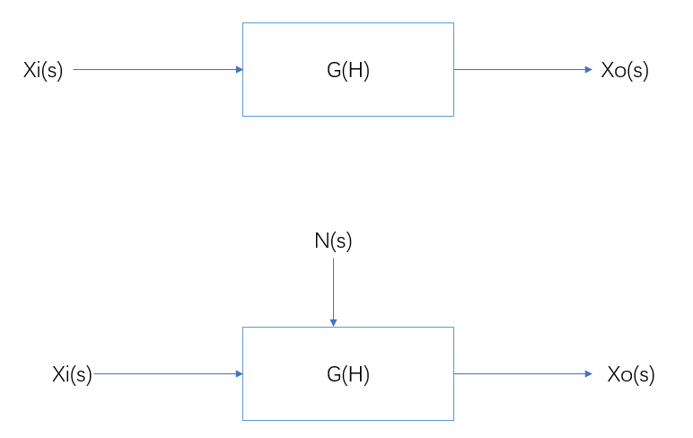
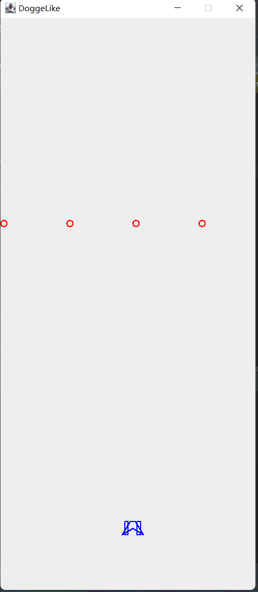

#   添加非玩家对象

***********

非玩家对象其实可以简单的理解为“人机”，这种对象的行为虽然会因为玩家对象而改变，但是绝对不会受到玩家的直接影响。

虽然都是对象，可能都有生命值，护甲值，甚至可能在对玩家的直接体验上任何的属性都是一致的，
但在程序的设计层面，大部分的逻辑都是计算机可以是内部单线程操作非玩家对象，可以是一个稳定的无扰动控制系统，而玩家对象需要其他线程进行介入，是个有扰动的控制系统，
存在本质上的不同。

因此，在设计此类对象的时候最好进行单独设计，虽然可能会增加工作量和资源占用量，但可以降低两个系统直接的耦合性。



<br>

<br>

## 非玩家对象组成

************

对于此项目而言，非玩家对象应该是敌人。

他应该有自己的外形，运动方式，生成方式以及消失方式。

为了让所有的敌人都拥有这些方法，可以新建一个接口 *Mon2d* 

*            - Mon2d
             - heart_poi() //用于定义实例的空间坐标
             - gener_func() //用于定义对象的形状以及生成方式
             - dist_func() //对象的消失方式
             - move_func() //用于定义实例运动方式           


<br>

## 实现第一个非玩家对象
*******
作为我们建立的第一个敌人，可以简单点，用一个红色的圆圈代替。

在这里，我所定义的非玩家对象是在屏幕最上方自上而下掉落4个红色圆圈,每个红色圆圈间隔100

```java
//新建一个名为Circle类
public class CirCle extends JPanel implements Mon2d {
   public static int[][] heart_poi = null;
   public void paint(Graphics g){

        if (heart_poi == null) {
            heart_poi = heart_poi();
        }
        Graphics2D gd = (Graphics2D) g;
        gd.setColor(Color.red);
        BasicStroke edge = new BasicStroke(2, BasicStroke.CAP_ROUND, BasicStroke.JOIN_ROUND);
        //绘制所有图案
        for (int i=0;i<heart_poi.length;i++){
            gd.drawArc(heart_poi[i][0],heart_poi[i][1],5,5,0,360);
        }
    }
    
  //获得所有核心点的直接操作形式
  @Override
  public int[][] heart_poi() {
    ArrayList ary = gener_func(0);
    int[][] o_poi = new int[ary.size()][2];

    for(int i =0;i<ary.size();i++){
      o_poi[i] = new int[] {(int) ary.get(i), 0};
    }
    return o_poi;
  }

  //碰撞箱，对象之间交互用
  @Override
  public void hit_box() {

  }

  //定义个体核心位置，并返回核心点
  @Override
  public ArrayList gener_func(int seed){
    ArrayList<Object> heart_pois = new ArrayList<>();
    for(int i =seed;i<400 ;i+=100){
      heart_pois.add(i);
    }
    return heart_pois;
  }

  //消失方式判断,如果调出边界，则为真
  @Override
  public boolean dist_func() {
  }

  //核心点移动方式，每次向下移动5
  @Override
  public void move_func(){
    for (int i = 0; i < heart_poi().length; i++) {
      heart_poi[i][1] = heart_poi[i][1] + 5;
    }
  }
}
```

但当将其直接通过 __.add()__ 方法添加如JFrame的时候出现了问题：

__.super()__ 方法是针对整个画布的，调用后会清除我们不想清除的内容，所以这个方法应该在我们将每一帧的内容完全绘制完全后才能被调用，
因此对于动态绘图而言，这个方法每帧只能调用一次。

为此，可以单独建立一个 *Round* 类，让其作为我们的唯一绘图容器，去接收两种对象的绘画方式，进行统一绘制。

```java
public class Round extends JPanel {

    private static int[] o_poi = {200,850};
    private static ship new_ship = new ship(o_poi);
    private static CirCle cc = new CirCle();

    //只能在最高层JPanel进行paint。
    //并且在定义完绘图方法后才会进行统一绘制
    public void paint(Graphics graphics){

        //父类中的paint为清空整个画卷
        super.paint(graphics);
        paint_all(graphics);
    }
    public void paint_all(Graphics graphics){
        new_ship.getCreatShip(o_poi).paint_ship(graphics);
        cc.paintCC(graphics);
        cc.move_func();

    }

    public void ship_fly() {

        KeyListener l = new KeyAdapter() {
            @Override
            public void keyPressed(KeyEvent e) {
                super.keyPressed(e);
                int presskey = e.getKeyCode();

                switch (presskey) {
                    case KeyEvent.VK_UP:
                        System.out.println("up");
                        o_poi[1] -= 5;
                        System.out.println(o_poi.toString());
                        break;
                    case KeyEvent.VK_DOWN:
                        System.out.println("down");
                        o_poi[1] += 5;
                        break;
                    case KeyEvent.VK_LEFT:
                        System.out.println("left");
                        o_poi[0] -= 5;
                        break;
                    case KeyEvent.VK_RIGHT:
                        System.out.println("right");
                        o_poi[0] += 5;
                        break;
                }
                repaint();
            }
        };

        this.addKeyListener(l);
        this.requestFocus();
    }
}
```

```xml
可以注意到，我将原本在 ship 类中实现的键盘监听搬运到这里来了，这是因为我们的ship将不再作为画纸，
然而监听的需要是 JPane 类对象
```

<br>

##  非玩家对象的运动

**********

运动永远是与时间相关的，玩家对象运动的实现是靠的玩家操控方向键之间的间隔，而非玩家对象运动则靠的是绘制每一帧的时间差。

可以注意到，上述代码中所定义的运动感方式是静态的，可以简单理解为实现了非玩家对象在下一帧应该出现的位置。

如同玩家对象的“运动方式”，这个运动的实现是在 *background* 中实现的：

```java
while (true){
            try {
                //调用Round类对象的repaint方法
                rd.repaint();
                //绘制每一帧之间的间隔为200ms
                TimeUnit.MILLISECONDS.sleep((long) 200);
                //这里调用的.sleep()方法会抛出异常
            }catch (InterruptedException e){
                System.out.println("SMT ERROR");
                break;
            }
        }
```

************

<br>

### 效果展示


