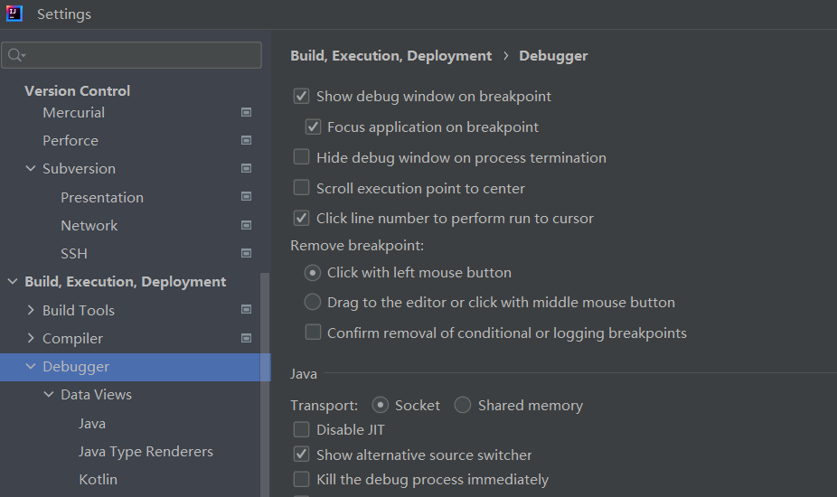
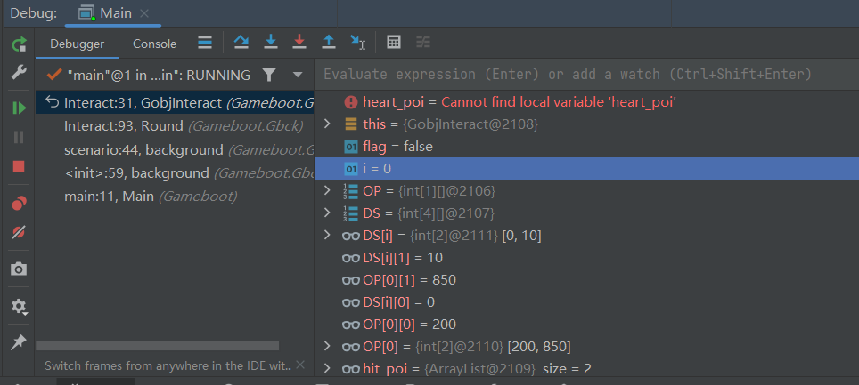
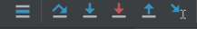

# IDEA的debug功能

***********

在运行功能模块中，IDEA的使用与VS来说有些许不同。

在VS中，是通过下来菜单来选择运行模式，一般有 `Debug` `Run` 和 `Release` 三种模式。

而在IDEA中，没有 `Release` 模式，并且将 `Debug` 和 `Run` 两种模式分开。

其中 `Run` 模式是我们所熟知的运行整个项目代码，所有变量将会直接运行在内存中，无法被开发者监视。除非人为中断，只能等待程序自行结束。

而 `Debug` 模式下不仅可以监视开发者设置的变量，还可以自定义程序的运行位置，实时调控。特别实在项目较为复杂的情况下，合理运用 `Debug` 模式将为开发者节省大量的时间与精力

 

 

## Debug 前准备

***********

1. 开启debug功能：

进入` 文件 --> 设置 `中开启如下图所示的窗口，即可在运行debug模式下看到编译器窗口下方的debug窗口

如果未能看到上述图片内容，可以查看` 视图-->工具栏` 是否勾选

2. 断点与debug窗口监控

这是debug的核心功能之一，只需要在你想运行到的代码的下一行前面点击一下，则会出现一个红色的原点。
debug模式下会在运行时到打了断点的上一行代码暂停。如果有多个断点，则会在第一个断点暂停。如果不打，则debug模式和run模式没有区别。

此时，你可以在debug窗口看到各种变量：

在这里，可以通过右键变量名对变量进行跟踪、修改等一系列操作。
不仅如此，还能够追溯到变量产生的地方和变化的过程，并且这些变化在代码窗口也会显示。

在这里可以注意到最左侧有一列功能菜单，其中播放按钮表示从断点开始运行到程序逻辑中的下一个断点，如果没有则运行到程序结束。

暂停按钮可以随时暂停程序。终止按钮为终止程序。剩下两个分别为查看断点和失效断点。

3. 单步调试

 

Show Execution Point (Alt + F10)：如果你的光标在其它行或其它页面，点击这个按钮可跳转到当前代码执行的行。

Step Over (F8)：步过，一行一行地往下走，如果这一行上有方法不会进入方法。

Step Into (F7)：步入，如果当前行有方法，可以进入方法内部，一般用于进入自定义方法内，不会进入官方类库的方法。

Force Step Into (Alt + Shift + F7)：强制步入，能进入任何方法，查看底层源码的时候可以用这个进入官方类库的方法。

Step Out (Shift + F8)：步出，从步入的方法内退出到方法调用处，此时方法已执行完毕，只是还没有完成赋值。

Drop Frame (默认无)：回退断点 。

Run to Cursor (Alt + F9)：运行到光标处，你可以将光标定位到你需要查看的那一行，然后使用这个功能，代码会运行至光标行，而不需要打断点。

