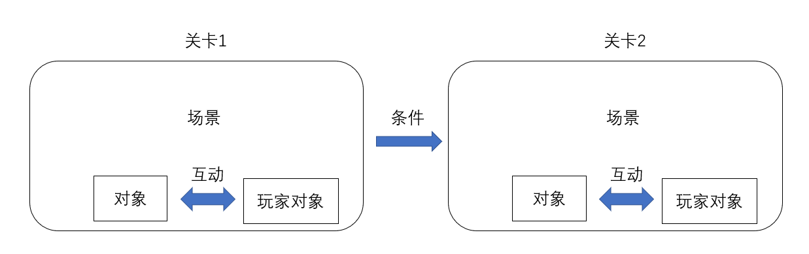
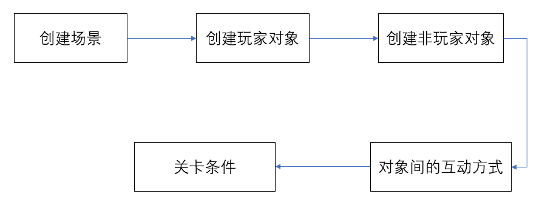

# 小飞机射击游戏
*******************

## 玩法设计
*****************
这是一个拥有无限周期的闪避类竖版2D游戏。玩家需要控制飞船躲避怪物的攻击。
 
 

## 功能需求设计
*****************
### 基础功能
1.玩家可用通过操作指定按键实现飞船的移动

2.怪物能够在*场景*中飞行

3.当飞船与怪物碰撞，飞船会爆炸，游戏结束
 

### 高级功能

1.为不同的玩家制定独立的玩家档案

2.记录每个玩家的得分情况

3.结合玩家的操作记录和关卡难度分析玩家水平

4.根据玩家多次的游玩记录，绘制其成长曲线图
 

## 整体框架搭建
*****************
首先可以了解游戏的组成为以下几点：

1.__场景__：即整个游戏的背景，*场景*作为一个容器，包含并承载了整个游戏的内容。 

2.__对象__：即我们所熟知的游戏中的各种怪物、玩家操控的英雄等可以进行一定互动的物体。 

3.__关卡__：他与前两者不同，*关卡*属于对象在场景中的一个互动阶段。

最后，根据我们所设想的玩法以及功能需求，可以搭建出小飞机射击的整体框架：

 

 
 
根据整理出来的整体框架，我们就能按照需求一步步去完善这个项目啦
 

[DoggeLike开发目录](./index.md)

