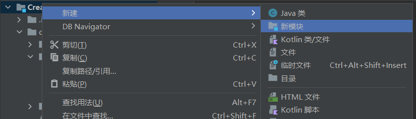
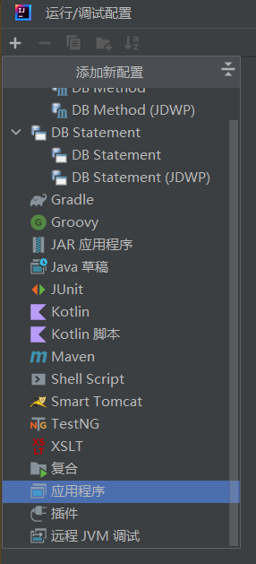

# 同项目运行多个模块

(这里以Maven项目为例)

*************

## 创建多个模块

1. 按照正常步骤创建项目
2. 这个时候 src 资源目录是父项目的，建议删除
3. pom 文件资源为子项目共享的
4. 右键父目录添加 module

5. pom 只在当前模块及其子模块中生效
6. 但项目多模块设置完毕

*********

## 运行多个实例

1. 其实只要右键需要运行的主类并运行就可以了
2. 但是建议用这个
3. 还有这个
4. 然后给每个模块添加一个文件夹
5. 运行后的进程可以在左下角的里边单独管理
