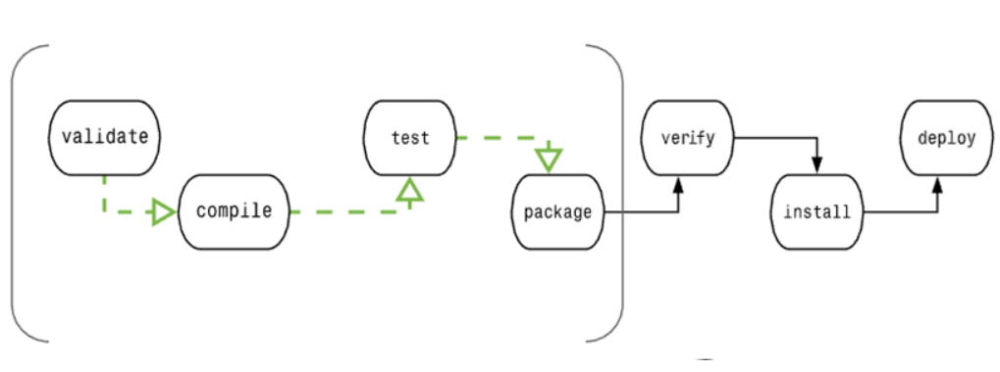

# Maven 工具

*********

右边框的 `Maven` 可以打开Maven项目的工具，包含很多功能

最常用的是 **install** 和 **clean** 


*****************

_**clean**_

```markdown
这个用来清除构建的target目标文件
```

***************

**validate**

```markdown
验证项目是否正确，eg:验证文件是否可用
```

**************

**compile**

```markdown
用于编译项目，可用于整个项目周期的各个阶段
```

**************

**test**

```markdown
类似compile但是只会编译位于test目录下的项目
```

**************

**package**

```markdown
不仅会编译文件，还会打成一个jar包
```

**************

**verify**

```markdown
对集成测试的结果进行检查，以保证质量达标
```

**************

**install**

```markdown
安装构建文件，安装打包的项目到本地仓库，以供其他项目使用，可以用于清除构建缓存，一般与clean连用
```

**************

**site**

```markdown
项目站点文档创建的处理
```

****************

**deploy**

```markdown
拷贝最终的工程包到远程仓库中，以共享给其他开发人员和工程
```

**************

一个Maven项目的构建周期



转自菜鸟教程